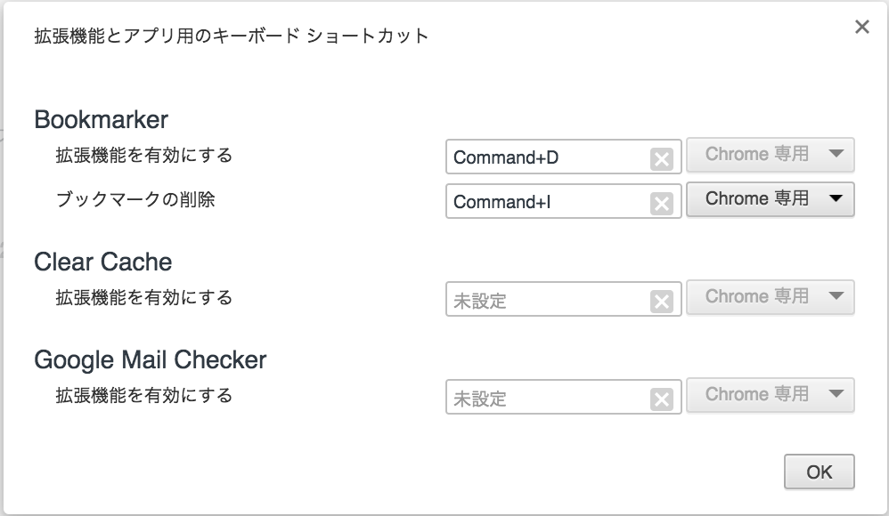

# Bookmarker
あなたのメモリを解放するブックマークマネージャー

### install
 1. [chrome web store](https://chrome.google.com/webstore/detail/bookmarker/glhpfpaemdkplbllfmkbigklacjneoba)でダウンロードしてください
 
 
 2. ダウンロード完了後、 Chromeの[拡張機能](chrome://extensions/)で、ページ一番下のキーボードショートカットを選択
 
 
 3. すると下のような画面が現れるので、「拡張機能を有効にする」の横の入力バーをクリックして、好きなショートカットを入力（キーボードで実際に押してください）（Ctrl / Command + Dを推奨）
     同じように、「ブックマークの削除」の横でもショートカットを入力します。（Ctrl / Command + Iを推奨）
 
 
 
 
 

### how to use
1. ポップアップウィンドウの表示
    登録したショートカットを入力すると表示されます。

2. ブックマークの登録

    Bookmarkerは、より直感的な操作をするために、ブックマークの重要度に応じて、あなたのブックマークを分けます。

    - Favorite  (Command + 1 or Ctrl + 1）
        SNSやニュースサイトなど、常にチェックするブックマークです。

    - Check  (Command + 2 or Ctrl + 2）
        ちょっと気になったニュース記事やイベントのサイトなどを登録するためのブックマークです。次に開いた時に自動で消去されます。
        以前開いていた時のスクロールの情報が保持されます。

    - Other  (Command + 3 or Ctrl + 3）
        上の2つには入らないような、時々使うブックマーク。
        以前開いていた時のスクロールの情報が保持されます。

    - Project  (Command + 4 or Ctrl + 4）
        プロジェクトでまとめて、ブックマークを管理することができます。（詳しくはプロジェクトを参照）
        以前開いていた時のスクロールの情報が保持されます。

    ###登録方法
        - ポップアップウィンドウでやる方法
            それぞれ、名前の横のアイコンのボタンまたはコマンドで登録することができます。

            検索バーに登録する名前を入力します。（この時、名前だけでなく検索するためのワードなどを入れておくとより便利になりますより便利になります）

            その後、フォルダを選択することができるので入れたいフォルダを選択して、クリックまたはenterでブックマークを登録することができます。

        - chromeの標準の方法
            Chromeのブックマークマネージャーなどで、ブックマークを生成されるFavoliteなどのフォルダにドラッグアンドドロップすることでも変更することができます。
            ※フォルダごと移動した場合は、フォルダ内のすべてのブックマークが変更されます。

3. ブックマークの削除

    登録したショートカットでブックマークを削除することができます。また、今まで通りのやり方（chromeの標準の削除方法）でも削除することができます。

4. タブ・ブックマーク・プロジェクトの検索

    ポップアップウィンドウを表示すると、検索バーにカーソルが表示されます。
    そこで、検索ワードを入れて検索し、マウスや矢印キーで選択します。その後、左クリック・enterで現在のタブで開く、右クリック・shift + enterで新しいタブを開いて開くことができます。

    検索結果は、タブ・プロジェクト・ブックマーク（名前で検索）・ブックマーク（URLで検索）の順に表示されます。
    その中で、さらにブックマークはFavorite・Check・Otherの順に表示され、また開いた回数の多い順に表示されます。

5. プロジェクト

    Bookmarkerには、あなたの仕事などのプロジェクト単位で調べ物などを管理してくれるprojectという機能があります。

    projectは、常にウィンドウ単位で管理され、ウィンドウを閉じるとともにその時に開いていたタブを自動的にブックマークに登録し、次に開いた時に表示します。
    ウィンドウ単位で管理されるので、タブを閉じると自動でブックマークから消去されます。

    projectを作るにはまずウィンドウに登録したいタブを**すべて**開きます。
    ポップアップウィンドウを開いて、command + pを押します

    すると、プロジェクトの名前が入力できるようになるので、名前を入力します。

    最後にenterを押すと、プロジェクトが作成されます。

    様々な調べ物をして、作業を終える時にウィンドウを閉じる（command / ctrl + shift + w や　ウィンドウの閉じるボタンを押す）と自動的に、開いているタブがブックマークに登録されます。

    次に、プロジェクトを開くときは、ポップアップウィンドウを出して、プロジェクトの名前を入力して、検索結果に表示されたプロジェクトを選択して、enterまたはクリックするとまたプロジェクトを編集することができます。

6. その他
    - Bookmarkerで生成されるフォルダについて
        Bookmarkerで生成されるフォルダは、消すことができません。消すと自動的にブックマークバーに登録されるようになっています。
        また、これらのフォルダは好きな場所に動かして利用することや自分の好きな名前に変えることも可能です。

7. バグ
    発見され次第、追記します。